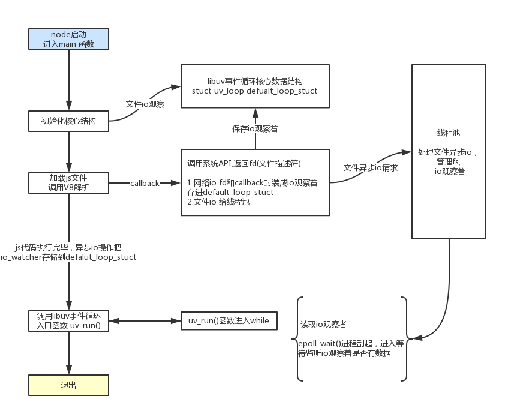

### NodeJS源码分析-1 Hello world

#### 简要
Node已经如今发展很快，已经相对稳定和成熟，在某些时候有必要知道其内部运行原理以及运行处理过程。
种一棵树最好的时间是十年前 其次是现在。希望能坚持下去。

### Nodejs当前最新版本 8.9.4
[NodeJS官方网站下载源码](https://nodejs.org/en/download/)


Node.js主要分为四大部分，Node Standard Library，Node Bindings，V8，Libuv

大体流程是这样的：

1. 初始化 V8 、LibUV , OpenSSL

2. 创建 Environment 环境

3. 设置 Process 进程对象

4. 执行 node.js 文件


解压包后代码结构如下：
```
├── AUTHORS
├── BSDmakefile   # bsd平台makefile文件
├── BUILDING.md
├── CHANGELOG.md
├── CODE_OF_CONDUCT.md
├── COLLABORATOR_GUIDE.md
├── CONTRIBUTING.md
├── CPP_STYLE_GUIDE.md
├── GOVERNANCE.md
├── LICENSE
├── Makefile     # Linux平台makefile文件
├── README.md
├── android-configure
├── benchmark
├── common.gypi
├── configure
├── deps          # Node底层核心依赖； 最核心的两块V8 Engine和libuv事件驱动的异步I/O模型库
├── doc           
├── lib           # Node后端核心库
├── node.gyp      # Node编译任务配置文件 
├── node.gypi
├── src           # C++内建模块
├── test          # 测试代码
├── tools         # 编译时用到的工具
└── vcbuild.bat   # Windows跨平台makefile文件
```

### Hello World 底层运行过程
[官方Hello world代码](https://nodejs.org/en/about/)
```
#app.js
const http = require('http');

const hostname = '127.0.0.1';
const port = 3000;

const server = http.createServer((req, res) => {
  res.statusCode = 200;
  res.setHeader('Content-Type', 'text/plain');
  res.end('Hello World\n');
});

server.listen(port, hostname, () => {
  console.log(`Server running at http://${hostname}:${port}/`);
});
```

一个简单的Helloworld涉及到多个模块：
- global 
- module
- http
- event
- net 

### 1.0 从main执行到js
入口 src/node_main.cc 106行 通过 src/node.cc 调用 node::Start(argc, argv);
node_main.cc
```
namespace node {
  extern bool linux_at_secure;
}  // namespace node

int main(int argc, char *argv[]) {
#if defined(__linux__)
  char** envp = environ;
  while (*envp++ != nullptr) {}
  Elf_auxv_t* auxv = reinterpret_cast<Elf_auxv_t*>(envp);
  for (; auxv->a_type != AT_NULL; auxv++) {
    if (auxv->a_type == AT_SECURE) {
      node::linux_at_secure = auxv->a_un.a_val;
      break;
    }   
  }
#endif
  // Disable stdio buffering, it interacts poorly with printf()
  // calls elsewhere in the program (e.g., any logging from V8.)
  setvbuf(stdout, nullptr, _IONBF, 0); 
  setvbuf(stderr, nullptr, _IONBF, 0); 
  // main作为入口调用node::Start
  return node::Start(argc, argv);
}
#endif
```

### 1.1 node::Start 加载js
调用顺序：

Start() -> LoadEnviroment() -> ExecuteString()

最终在LoadEnvrioment()里面加载node.js文件，调用ExecuteString() 解析执行node.js文件，返回值是一个f_value

并且在ExecuteString()调用V8的 Script::Compile() 和 Script::Run()两个接口去解析执行js代码。


node.cc
```
# Nodejs启动入口， 
inline int Start(Isolate* isolate, IsolateData* isolate_data,
                 int argc, const char* const* argv,
                 int exec_argc, const char* const* exec_argv) {
  HandleScope handle_scope(isolate);
  Local<Context> context = Context::New(isolate);
  Context::Scope context_scope(context);
  Environment env(isolate_data, context);
  CHECK_EQ(0, uv_key_create(&thread_local_env));
  uv_key_set(&thread_local_env, &env);
  env.Start(argc, argv, exec_argc, exec_argv, v8_is_profiling);

  const char* path = argc > 1 ? argv[1] : nullptr;
  StartInspector(&env, path, debug_options);

  if (debug_options.inspector_enabled() && !v8_platform.InspectorStarted(&env))
    return 12;  // Signal internal error.

  env.set_abort_on_uncaught_exception(abort_on_uncaught_exception);

  if (force_async_hooks_checks) {
    env.async_hooks()->force_checks();
  }

  {
    Environment::AsyncCallbackScope callback_scope(&env);
    env.async_hooks()->push_async_ids(1, 0);
    
    //加载nodejs文件后调用ExecuteString()
    LoadEnvironment(&env); 
    env.async_hooks()->pop_async_id(1);
  }

  env.set_trace_sync_io(trace_sync_io);
  //事件循环池
  {
    SealHandleScope seal(isolate);
    bool more;
    PERFORMANCE_MARK(&env, LOOP_START);
    do {
      uv_run(env.event_loop(), UV_RUN_DEFAULT);

      v8_platform.DrainVMTasks();

      more = uv_loop_alive(env.event_loop());
      if (more)
        continue;

      EmitBeforeExit(&env);

      // Emit `beforeExit` if the loop became alive either after emitting
      // event, or after running some callbacks.
      more = uv_loop_alive(env.event_loop());
    } while (more == true);
    PERFORMANCE_MARK(&env, LOOP_EXIT);
  }

  env.set_trace_sync_io(false);

  const int exit_code = EmitExit(&env);
  RunAtExit(&env);
  uv_key_delete(&thread_local_env);

  v8_platform.DrainVMTasks();
  WaitForInspectorDisconnect(&env);
#if defined(LEAK_SANITIZER)
  __lsan_do_leak_check();
#endif

  return exit_code;
}

```

### 核心运行流程
整体运行流程图


1. 核心数据结构 default_loop_struct 结构体为struct uv_loop_s
当加载js文件时，如果代码有io操作，调用lib模块->底层C++模块->LibUV(deps uv)->拿到系统返回的一个fd（文件描述符），和 js代码传进来的回调函数callback，封装成一个io观察者（一个uv__io_s类型的对象），保存到default_loop_struct.

2. 进入事件池， default_loop_struct保存对应io观察着，V8 Engine处理js代码, main函数调用libuv进入uv_run(), node进入事件循环 ,判断是否有存活的观察者
- 如果也没有io, Node进程退出
- 如果有io观察者， 执行uv_run()进入epoll_wait()线程挂起，io观察者检测是否有数据返回callback, 没有数据则会一直在epoll_wait()等待执行 server.listen(3000)会挂起一直等待。

###  Module对象
根据CommonJS规范，每一个文件就是一个模块，在每个模块中，都会有一个module对象，这个对象就指向当前的模块。
module对象具有以下属性：
- id：当前模块的bi
- exports：表示当前模块暴露给外部的值
- parent： 是一个对象，表示调用当前模块的模块
- children：是一个对象，表示当前模块调用的模块
- filename：模块的绝对路径
- paths：从当前文件目录开始查找node_modules目录；然后依次进入父目录，查找父目录下的node_modules目录；依次迭代，直到根目录下的node_modules目录
- loaded：一个布尔值，表示当前模块是否已经被完全加载

示例：
```
module.exports = { 
    name: 'fzxa',
    getAge: function(age){
            console.log(age)
    }   
}
console.log(module)
```
执行node module.js 返回如下
```
Module {
  id: '.',
  exports: { name: 'fzxa', getAge: [Function: getAge] },
  parent: null,
  filename: '/Users/fzxa/Documents/study/module.js',
  loaded: false,
  children: [],
  paths: 
   [ '/Users/fzxa/Documents/study/node_modules',
     '/Users/fzxa/Documents/node_modules',
     '/Users/fzxa/node_modules',
     '/Users/node_modules',
     '/node_modules' ] }
```
module对象具有一个exports属性，该属性就是用来对外暴露变量、方法或整个模块的。当其他的文件require进来该模块的时候，实际上就是读取了该模块module对象的exports属性

### exports对象
exports和module.exports都是引用类型的变量，而且这两个对象指向同一块内存地址
```
exports = module.exports = {};
```
例子：
```
var module = {
    exports: {}
}

var exports = module.exports

function change(exports) {
    //为形参添加属性，是会同步到外部的module.exports对象的
    exports.name = "fzxa"
    //在这里修改了exports的引用，并不会影响到module.exports
    exports = {
        age: 24
    }
    console.log(exports) //{ age: 24 }
}

change(exports)
console.log(module.exports) //{exports: {name: "fzxa"}}
```
直接给exports赋值，会改变当前模块内部的形参exports对象的引用，也就是说当前的exports已经跟外部的module.exports对象没有任何关系了，所以这个改变是不会影响到module.exports的

module.exports就是为了解决上述exports直接赋值，会导致抛出不成功的问题而产生的。有了它，我们就可以这样来抛出一个模块了.

### require方法
Node中引入模块的机制步骤
1. 路径分析
2. 文件定位
3. 编译执行
Node对引入过的模块也会进行缓存。不同的地方是，node缓存的是编译执行之后的对象而不是静态文件

Module._load的源码：
```
Module._load = function(request, parent, isMain) {

  //  计算绝对路径
  var filename = Module._resolveFilename(request, parent);

  //  第一步：如果有缓存，取出缓存
  var cachedModule = Module._cache[filename];
  if (cachedModule) {
    return cachedModule.exports;

  // 第二步：是否为内置模块
  if (NativeModule.exists(filename)) {
    return NativeModule.require(filename);
  }

  // 第三步：生成模块实例，存入缓存
  var module = new Module(filename, parent);
  Module._cache[filename] = module;

  // 第四步：加载模块
  try {
    module.load(filename);
    hadException = false;
  } finally {
    if (hadException) {
      delete Module._cache[filename];
    }
  }

  // 第五步：输出模块的exports属性
  return module.exports;
};
```
在Module._load方法的内部调用了Module._findPath这个方法，这个方法是用来返回模块的绝对路径的，源码如下：
```
Module._findPath = function(request, paths) {

  // 列出所有可能的后缀名：.js，.json, .node
  var exts = Object.keys(Module._extensions);

  // 如果是绝对路径，就不再搜索
  if (request.charAt(0) === '/') {
    paths = [''];
  }

  // 是否有后缀的目录斜杠
  var trailingSlash = (request.slice(-1) === '/');

  // 第一步：如果当前路径已在缓存中，就直接返回缓存
  var cacheKey = JSON.stringify({request: request, paths: paths});
  if (Module._pathCache[cacheKey]) {
    return Module._pathCache[cacheKey];
  }

  // 第二步：依次遍历所有路径
  for (var i = 0, PL = paths.length; i < PL; i++) {
    var basePath = path.resolve(paths[i], request);
    var filename;

    if (!trailingSlash) {
      // 第三步：是否存在该模块文件
      filename = tryFile(basePath);

      if (!filename && !trailingSlash) {
        // 第四步：该模块文件加上后缀名，是否存在
        filename = tryExtensions(basePath, exts);
      }
    }

    // 第五步：目录中是否存在 package.json 
    if (!filename) {
      filename = tryPackage(basePath, exts);
    }

    if (!filename) {
      // 第六步：是否存在目录名 + index + 后缀名 
      filename = tryExtensions(path.resolve(basePath, 'index'), exts);
    }

    // 第七步：将找到的文件路径存入返回缓存，然后返回
    if (filename) {
      Module._pathCache[cacheKey] = filename;
      return filename;
    }
 }

  // 第八步：没有找到文件，返回false 
  return false;
};

当我们第一次引入一个模块的时候，require的缓存机制会将我们引入的模块加入到内存中，以提升二次加载的性能。但是，如果我们修改了被引入模块的代码之后，当再次引入该模块的时候，就会发现那并不是我们最新的代码，这是一个麻烦的事情。如何解决呢
require有如下方法：
require(): 加载外部模块
require.resolve()：将模块名解析到一个绝对路径
require.main：指向主模块
require.cache：指向所有缓存的模块
require.extensions：根据文件的后缀名，调用不同的执行函数

```
//删除指定模块的缓存
delete require.cache[require.resolve('/*被缓存的模块名称*/')]

// 删除所有模块的缓存
Object.keys(require.cache).forEach(function(key) {
     delete require.cache[key];
})
```
