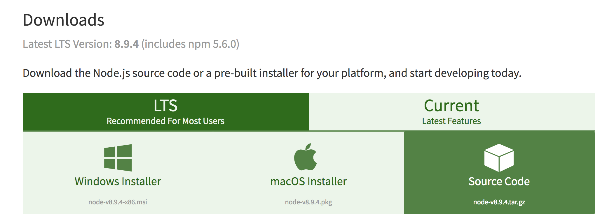

### NodeJS源码分析-1 Hello world

#### 简要
Node已经如今发展很快，已经相对稳定和成熟，在某些时候有必要知道其内部运行原理以及运行处理过程。
种一棵树最好的时间是十年前 其次是现在。希望能坚持下去。

### Nodejs当前最新版本 8.9.4
[NodeJS官方网站下载源码](https://nodejs.org/en/download/)


Node.js主要分为四大部分，Node Standard Library，Node Bindings，V8，Libuv

解压包后代码结构如下：
```
├── AUTHORS
├── BSDmakefile   # bsd平台makefile文件
├── BUILDING.md
├── CHANGELOG.md
├── CODE_OF_CONDUCT.md
├── COLLABORATOR_GUIDE.md
├── CONTRIBUTING.md
├── CPP_STYLE_GUIDE.md
├── GOVERNANCE.md
├── LICENSE
├── Makefile     # Linux平台makefile文件
├── README.md
├── android-configure
├── benchmark
├── common.gypi
├── configure
├── deps          # Node底层核心依赖； 最核心的两块V8 Engine和libuv事件驱动的异步I/O模型库
├── doc           
├── lib           # Node后端核心库
├── node.gyp      # Node编译任务配置文件 
├── node.gypi
├── src           # C++内建模块
├── test          # 测试代码
├── tools         # 编译时用到的工具
└── vcbuild.bat   # Windows跨平台makefile文件
```

### Hello World 底层运行过程
[官方Hello world代码](https://nodejs.org/en/about/)
```
const http = require('http');

const hostname = '127.0.0.1';
const port = 3000;

const server = http.createServer((req, res) => {
  res.statusCode = 200;
  res.setHeader('Content-Type', 'text/plain');
  res.end('Hello World\n');
});

server.listen(port, hostname, () => {
  console.log(`Server running at http://${hostname}:${port}/`);
});
```
整体运行流程图


一个简单的Helloworld涉及到多个模块：
- global 
- module
- http
- event
- net 
